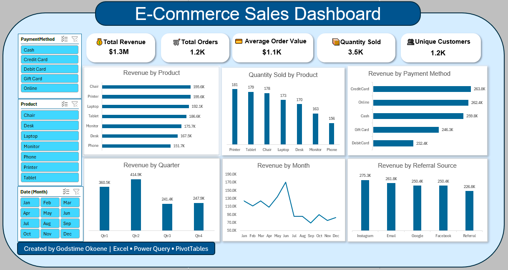

# E-Commerce Sales Analysis Dashboard (Excel)

> An end-to-end Microsoft Excel analytics project demonstrating data cleaning, exploratory data analysis (EDA), KPI development, and interactive dashboard design for business decision-making.



---

# Table of Contents

* [Project Overview](#project-overview)
* [Business Problem](#business-problem)
* [Dataset](#dataset)
* [Repository Structure](#repository-structure)
* [Tools & Technologies](#tools--technologies)
* [Data Cleaning](#data-cleaning)
* [Exploratory Data Analysis (EDA)](#exploratory-data-analysis-eda)
* [KPI Summary](#kpi-summary)
* [Dashboard](#dashboard)
* [Key Insights](#key-insights)
* [Business Recommendations](#business-recommendations)
* [Skills Demonstrated](#skills-demonstrated)
* [How to Use](#how-to-use)
* [Author](#author)

---

# Project Overview

This project analyzes an e-commerce sales dataset using **Microsoft Excel** to transform raw transactional data into actionable business insights. The workflow covers data cleaning with **Power Query**, exploratory data analysis using **PivotTables and PivotCharts**, KPI development, and the creation of an interactive dashboard that enables stakeholders to monitor sales performance and support data-driven decision-making.

---

# Business Problem

Business stakeholders require a clear understanding of sales performance, customer purchasing behaviour, and product trends to make informed operational and strategic decisions.

This project addresses that need by answering key business questions such as:

* Which products generate the highest revenue?
* How does revenue change over time?
* Which payment methods are most frequently used?
* Which referral sources drive the most sales?
* What is the average customer spend?
* How many unique customers placed orders?

---

# Dataset

The dataset contains transactional e-commerce sales records, including:

* Order ID
* Customer ID
* Product
* Category
* Quantity
* Unit Price
* Total Revenue
* Order Date
* Payment Method
* Referral Source
* Order Status
* Tracking Number

---

# Repository Structure

```text
📦 ecommerce-sales-analysis-excel
│
├── README.md
├── LICENSE
├── .gitignore
│
├── Data
│   ├── Raw_Data.xlsx
│   └── Cleaned_Data.xlsx
│
├── Dashboard
│   └── Dashboard.png
│
├── EDA
│   ├── Statistical_EDA.xlsx
│   └── KPI_Summary.xlsx
│
├── Images
│   ├── dashboard.png
│   ├── power_query.png
│   ├── slicers.png
│   └── cleaning_steps.png
│
├── Documentation
│   └── Cleaning_Log.xlsm
│
└── PowerQuery
    └── M_Code.txt
```

---

# Tools & Technologies

* Microsoft Excel
* Power Query
* PivotTables
* PivotCharts
* Slicers
* Conditional Formatting
* Data Validation

---

# Data Cleaning

Data preparation was completed using **Power Query**.

Cleaning activities included:

* Removed duplicate records
* Corrected inconsistent date formats
* Standardized text values
* Treated missing values
* Corrected data types
* Validated numerical fields
* Prepared data for analysis and reporting

---

# Exploratory Data Analysis (EDA)

The following analyses were performed:

* Revenue by Product
* Revenue by Month
* Revenue by Quarter
* Revenue by Category
* Quantity Sold
* Payment Method Analysis
* Referral Source Analysis
* Customer Analysis
* Average Order Value
* Unique Customer Analysis
* Order Status Analysis

---

# KPI Summary

| KPI                 | Value |
| ------------------- | ----- |
| Total Revenue       | $1.3M |
| Total Orders        | 1.2K  |
| Average Order Value | $1.1K |
| Quantity Sold       | 3.5K  |
| Unique Customers    | 1.2K  |

---

# Dashboard

The interactive dashboard provides executives with a consolidated view of sales performance through KPI cards, PivotCharts, filters, and slicers.


Dashboard Features:

* KPI Cards
* Interactive Slicers
* Monthly Revenue Trend
* Product Performance
* Referral Source Analysis
* Payment Method Analysis

---

# Key Insights

* Q2 generated the highest overall revenue.
* Chairs and Printers were the highest-performing products.
* Online payments contributed the largest share of revenue.
* Instagram generated the highest referral revenue.
* Revenue peaked in June before declining in subsequent months.
* A small number of products accounted for a significant share of total sales.

---

# Business Recommendations

* Increase marketing investment during high-performing quarters.
* Maintain sufficient inventory for top-selling products.
* Expand campaigns on high-performing referral channels.
* Encourage online payment adoption through incentives.
* Investigate factors contributing to declining sales after June.
* Continuously monitor KPIs to support timely business decisions.

---

# Skills Demonstrated

* Microsoft Excel
* Power Query
* Data Cleaning
* Exploratory Data Analysis (EDA)
* KPI Development
* PivotTables
* PivotCharts
* Dashboard Design
* Business Intelligence
* Data Visualization
* Analytical Thinking
* Business Reporting

---

# How to Use

1. Clone or download this repository.
2. Open **Dashboard/Dashboard.xlsx** in Microsoft Excel.
3. Enable Editing if prompted.
4. Use the interactive slicers to filter the dashboard.
5. Review the KPI cards, PivotCharts, and business insights.

---

# Author

**Godstime Okoene**

**Data Analyst**

**Tech Stack**

Excel • Power Query • Power Pivot

**Connect with me**

* LinkedIn: https://linkedin.com/in/godstime-osebhahiemen
* GitHub: https://github.com/GGStyles
